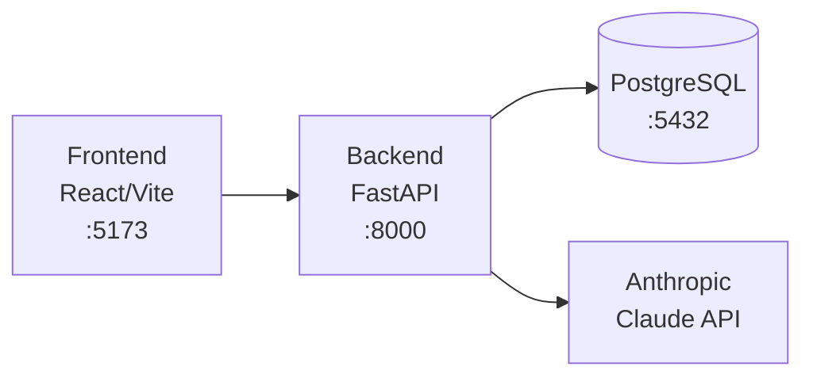

# Finance Advisor

Personal Finance Advisor — an AI-powered application for tracking spending, analyzing budgets, and getting financial coaching. Upload your CIBC bank transaction CSVs and get actionable insights.

## Tech Stack

- **Frontend:** React + TypeScript + Vite + Tailwind CSS 4 + shadcn/ui
- **Backend:** Python 3.12 + FastAPI + SQLAlchemy + Alembic (managed with uv)
- **Database:** PostgreSQL 16
- **AI:** Anthropic Claude API
- **Infrastructure:** Docker Compose + GitHub Actions CI

## Architecture



## Quick Start

### Prerequisites

- Docker & Docker Compose
- An Anthropic API key (for AI features)

### Setup

1. Clone the repository:
   ```bash
   git clone https://github.com/HassanA01/finance-advisor.git
   cd finance-advisor
   ```

2. Copy environment variables:
   ```bash
   cp .env.example .env
   ```

3. Edit `.env` and add your `ANTHROPIC_API_KEY` and generate a `JWT_SECRET`:
   ```bash
   openssl rand -hex 32  # Use output as JWT_SECRET
   ```

4. Start all services:
   ```bash
   docker compose up --build
   ```

5. Run database migrations:
   ```bash
   docker compose exec backend alembic upgrade head
   ```

6. Open the app: [http://localhost:5173](http://localhost:5173)

## Development

### Common Commands

```bash
# Start all services
docker compose up --build

# Start in background
docker compose up -d

# View logs
docker compose logs -f backend
docker compose logs -f frontend

# Stop everything
docker compose down

# Reset database (destroys data)
docker compose down -v

# Run backend tests
docker compose exec backend uv run pytest -v

# Run migrations
docker compose exec backend uv run alembic upgrade head

# Create new migration
docker compose exec backend uv run alembic revision --autogenerate -m "description"

# Run backend linting
docker compose exec backend uv run ruff check app/
docker compose exec backend uv run ruff format app/

# Access database
docker compose exec db psql -U finance -d finance_advisor
```

### Pre-commit Hooks

This project uses pre-commit for code quality:

```bash
# Install pre-commit (use pipx or uvx to avoid global installs)
uvx pre-commit install
```

Hooks run automatically on commit: ruff (Python lint/format), eslint (TypeScript), tsc (type check).

## Contributing

1. Create a feature branch: `feat/<issue-number>-<description>`
2. Write tests for new code
3. Ensure Docker builds and tests pass
4. Open a PR to `main`
5. Wait for CI to pass + approval
